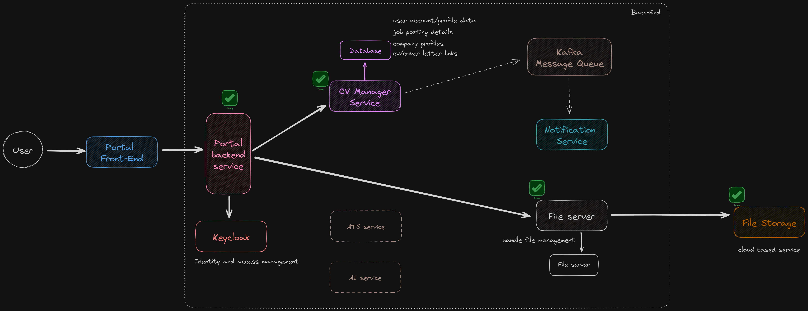

<h1 align="center" id="title">Cv manager - Commons</h1>

<a id="description">https://github.com/career-opz/commons</a>

<h2>🛠️ Installation Steps:</h2>
<br>

<h3>1. clone this repo first</h3>

```
git clone https://github.com/career-opz/commons.git
```
<br>
<h3>2. install the artifacts to the local maven repo</h3>
<p>This will install the common artifacts which are the dependencies of the other microservices so that they can use it</p>

```
./mvnw clean install
```

<br>
<p>If there are any changes to this project done by other devs, please don't forget to update your local repo and run the above clean install command</p>

<h2>📷 Project high level architecture:</h2>

